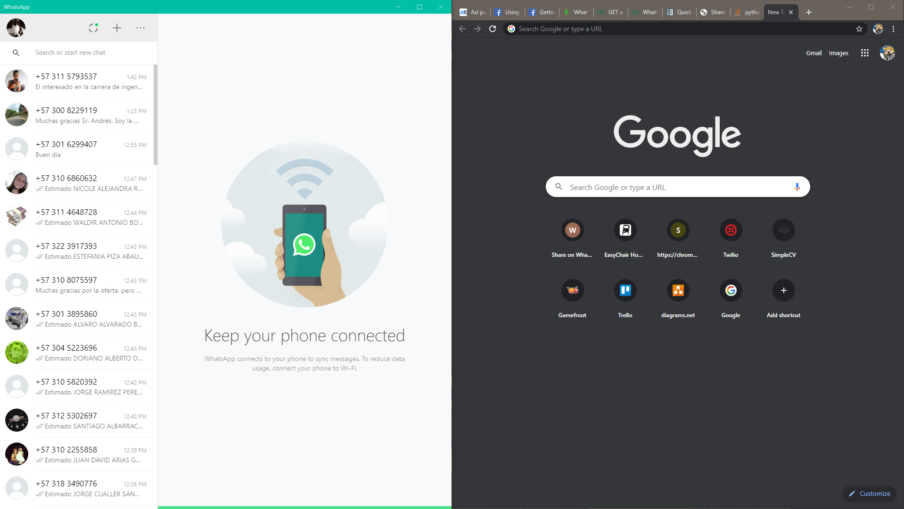

# About

Greetings fellow hoomanz, this python script is used to automate the very time consuming task of contacting a given list of unknow users through WhatsApp when you're on a budget and have not gotten access to a Business account byt replicating the minimum amount of steps a human being would have to follow to perform said task using PyAutoGUI.

## Requirements

You will need to have windows (as the script hasn't been tested in any other OS), the WhatsApp Desktop App and Google Chrome, as well as provide an input file (spamDB.txt) containing the information of the persons you want to contact in a per line basis (e.g. fakename fakelastname, 123412321), then, set both programs on your primary desktop (in case you're using a multiple display set up), as shown below :

Following this, run the script and make sure the only things visible in the screen is the aforementioned message.

## Limitations

It goes without saying that this script only works with the given setup and only under the aforementioned conditions, so your results may vary.

## Credits Lincenses and such

This program was created by Andres Mrad (Q-ro) under the GPL license, run it at your own risk ;).